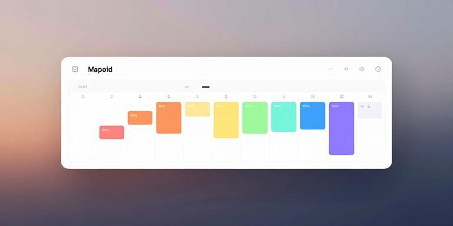

# Calendar Display

A macOS application that displays your Apple Calendar events in a horizontal timeline view.

## Purpose

Calendar Display provides a visual overview of your upcoming calendar events, showing them in a horizontal format that makes it easy to see your schedule at a glance. It integrates directly with Apple Calendar using EventKit to display real events from your calendars.

## Requirements

- macOS (required for Apple Calendar integration)
- Python 3.11 or higher
- Calendar access permission (you'll be prompted to grant access on first run)

## Installation

1. Clone or download this repository
2. Install the required Python dependencies:

```bash
pip install -r requirements.txt
```

## Usage

All commands are run through the `./run` script.

### Launch the Calendar Display

```bash
./run start
```

This opens the calendar display showing the next 2 days of events by default.

### Show More Days

```bash
./run start --days 3
```

Display events for the next 3 days (or any number you prefer).

### Run Tests

```bash
./run check
```

Runs the full test suite and quality checks.

### Run a Single Test

```bash
./run test src/calendar_access_test.py::test_event_dataclass
```

### Run Linter

```bash
./run lint
```

## Examples

View today and tomorrow's events:
```bash
./run start
```

View a full week of events:
```bash
./run start --days 7
```

View just today:
```bash
./run start --days 1
```